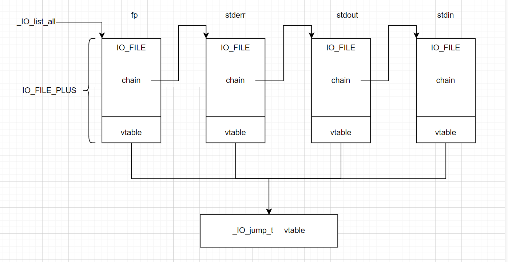

## IO相关结构体

进行文件读写操作时，会创建一个结构体`_IO_FILE_plus`：
```c
struct _IO_FILE_plus
{
    _IO_FILE    file; 
    _IO_jump_t   *vtable;  //指向一张虚函数表_IO_jump_t，该表中记录着对文件的各种操作
    //vtable一般都不可修改。vtavle是否可写跟libc有关，有的高版本libc反而可写
}
```
在标准I/O库中，每个程序启动时有三个文件流是自动打开的：stdin、stdout、stderr，分别对应文件描述符0,1,2
```c
pwndbg> p _IO_2_1_stdout_
$4 = {
  file = {
    _flags = -72540028,
    _IO_read_ptr = 0x0, 
    _IO_read_end = 0x0,
    _IO_read_base = 0x0,
    _IO_write_base = 0x0,
    _IO_write_ptr = 0x0,
    _IO_write_end = 0x0,
    _IO_buf_base = 0x0,
    _IO_buf_end = 0x0,
    _IO_save_base = 0x0,
    _IO_backup_base = 0x0,
    _IO_save_end = 0x0,
    _markers = 0x0,
    _chain = 0x7ffff7e1aaa0 <_IO_2_1_stdin_>,
    _fileno = 1,
    _flags2 = 0,
    _old_offset = -1,
    _cur_column = 0,
    _vtable_offset = 0 '\000',
    _shortbuf = "",
    _lock = 0x7ffff7e1ca70 <_IO_stdfile_1_lock>,
    _offset = -1,
    _codecvt = 0x0,
    _wide_data = 0x7ffff7e1a9a0 <_IO_wide_data_1>,
    _freeres_list = 0x0,
    _freeres_buf = 0x0,
    __pad5 = 0,
    _mode = 0,
    _unused2 = '\000' <repeats 19 times>
  },
  vtable = 0x7ffff7e17600 <_IO_file_jumps>
}
```
对于`_IO_jump_t`，有：
```c
struct _IO_jump_t
{
    0x0:JUMP_FIELD(size_t, __dummy);
    0x8:JUMP_FIELD(size_t, __dummy2);
    0x10:JUMP_FIELD(_IO_finish_t, __finish);
    0x18:JUMP_FIELD(_IO_overflow_t, __overflow);
    0x20:JUMP_FIELD(_IO_underflow_t, __underflow);
    0x28:JUMP_FIELD(_IO_underflow_t, __uflow);
    0x30:JUMP_FIELD(_IO_pbackfail_t, __pbackfail);
    0x38:JUMP_FIELD(_IO_xsputn_t, __xsputn);
    0x40:JUMP_FIELD(_IO_xsgetn_t, __xsgetn);
    0x48:JUMP_FIELD(_IO_seekoff_t, __seekoff);
    0x50:JUMP_FIELD(_IO_seekpos_t, __seekpos);
    0x58:JUMP_FIELD(_IO_setbuf_t, __setbuf);
    0x60:JUMP_FIELD(_IO_sync_t, __sync);
    0x68:JUMP_FIELD(_IO_doallocate_t, __doallocate);
    0x70:JUMP_FIELD(_IO_read_t, __read);
    0x78:JUMP_FIELD(_IO_write_t, __write);
    0x80:JUMP_FIELD(_IO_seek_t, __seek);
    0x88:JUMP_FIELD(_IO_close_t, __close);
    0x90:JUMP_FIELD(_IO_stat_t, __stat);
    0x98:JUMP_FIELD(_IO_showmanyc_t, __showmanyc);
    0xa0:JUMP_FIELD(_IO_imbue_t, __imbue);
    #if 0
        get_column;
        set_column;
    #endif

}; 
```
一图以蔽之：



其中，`fp`是我们通过`fopen()`函数获取的文件指针，该结构体存储在堆中，大小为`0x1e0`；

`stderr`，`stdout`，`stdin`则均被存储在libc.so中

### 关于缓冲区：
由于每次进行I/O操作都需要进行系统调用，以及频繁的I/O读写可能会加速设备的损耗，于是诞生了缓冲区的概念。C语言中的缓冲区分为`全缓冲`、`行缓冲`与`无缓冲`

- 全缓冲：直到缓冲区满才进行IO操作
- 行缓冲：接收到换行符进行IO操作
- 无缓冲：直接进行IO操作

## FSOP

由于Linux中常见的IO函数的底层都是对IO_FILE结构体中vtable函数的调用，因此对vtable进行劫持或是对IO_FILE进行劫持都可以getshell

例如对于`printf`函数，有利用链；

`printf -> vfprintf -> buffered_vfprintf -> _IO_sputn`，

即调用printf函数最终会调用到vtable中的_IO_sputn指针，同时，IO_FILE结构体的首地址会被作为第一个参数传入，于是当我们可以覆写vtable中的_IO_sputn指针为system，以及将IO_FILE结构体的第一项写成`/bin/sh\x00`，当调用printf时即可getshell

但实际情况没有这么简单，上述调用链经过的每个函数可能都会有一定的check，需要满足这些check才能真正实际上完成调用。


### _IO_flush_all_lockp()

`_IO_flush_all_lockp()`函数在三种情况下会被调用：

- libc检测到内存错误，从而执行abort函数时(在glibc2.26移除)
- 程序执行`exit`函数时
- 程序从`main`函数返回时

当该函数被调用，最终会执行vtable中的`_IO_OVERFLOW`

对于该利用链，需要满足以下check：
```c
fp->_mode = 0
fp->_IO_write_ptr > fp->_IO_write_base
``` 
在libc 2.23下就能直接进行利用

## libc >= 2.24 后进行的FSOP

在libc 2.24开始对vtable加入了检查：

1. IO_validate_vtable()
2. _IO_vtable_check()

在调用vtable函数之前，会先进入`IO_validate_vtable()`函数：

```c
static inline const struct _IO_jump_t * IO_validate_vtable (const struct _IO_jump_t *vtable)
{
  uintptr_t section_length = __stop___libc_IO_vtables - __start___libc_IO_vtables;
  const char *ptr = (const char *) vtable;
  uintptr_t offset = ptr - __start___libc_IO_vtables;
  if (__glibc_unlikely (offset >= section_length)) //检查vtable指针是否在glibc的vtable段中。
    _IO_vtable_check (); //如果不在，需要判断是否是外部合法的vtable
  return vtable;
}
```
目前只有针对`IO_validate_vtable()`的绕过，即将fake vtable放置在glibc的vtable段中：

等待施工

## fileno相关利用


