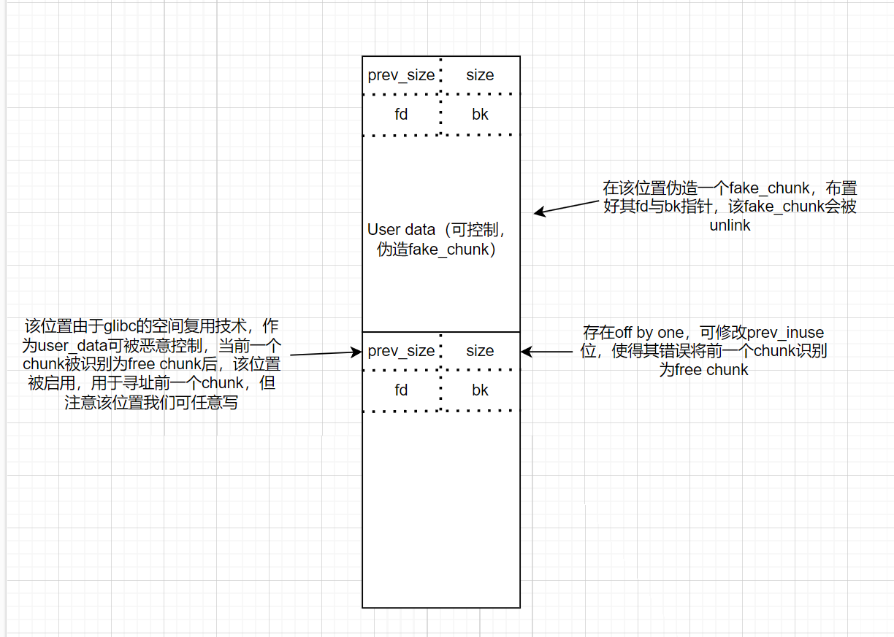
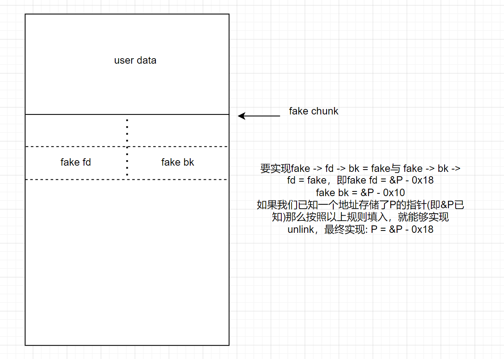
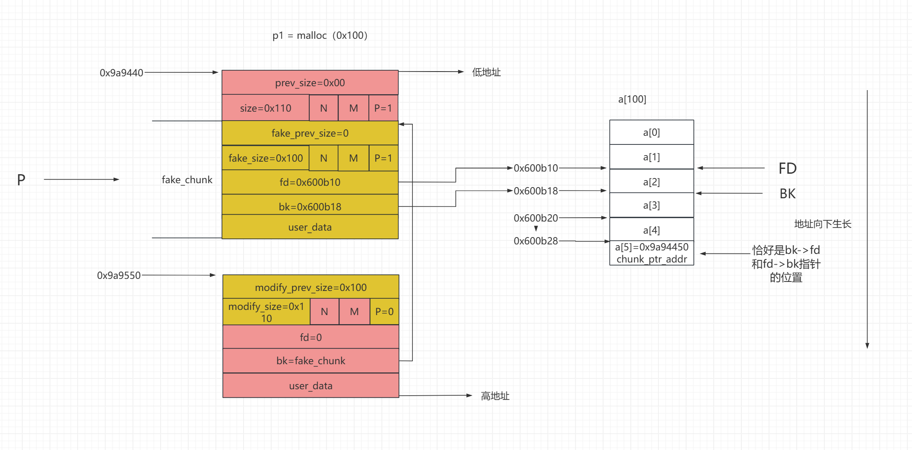

一个晚上一个奇迹

堆的具体手法和实际利用之间仍然具有一定距离，实际利用可能是多种手法的交叉利用。话虽如此，学习具体手法却是开始实际利用之前不可或缺的一环。

## double free
利用前提：具有UAF漏洞，bin为单向链表

利用过程：利用first_fit分配原则，诱导分配器将任意地址当成堆分配给用户

利用效果：任意地址读写
### fast bin double free
注意点：
1. fast bin对double free有检查，即检查fast bin指向的chunk与victim是否相同。所以不能连续两次释放同一个chunk。可以通过中间多free另一个chunk来绕过
2. fast bin会检查目标地址 + 8(即fake chunk的size位)是否符合fast bin大小

### tcache bin double free
顺带复习一下tcache bin：

tcache bin在glibc 2.26 (ubuntu 17.10)开始引入，其与fast bin具有相似的单向链表结构，但每种大小的fast bin只能容纳7个chunk

2.26 - 2.28: tcache不会检测double free，可以连续两次free同一个chunk

### glibc 2.31版本下的tcache double free
从2.29开始引入对double free的检查，glibc设计者加入key字段，防止double free。因此tcache_entry的结构发生了变化
```c
typedef struct tcache_entry
{
  struct tcache_entry *next;
  /* This field exists to detect double frees.  */
  struct tcache_perthread_struct *key;
} tcache_entry;
```
key一般会指向tcache_perthread_struct的mem，如果要free的chunk的key为这个值，就会触发检查，程序会遍历链表，检查这个tcache是不是已经在里面了。

这是一个优秀的剪枝，几乎不会影响性能，非double free情况下触发这个检查的概率极低，而double free又很容易被检查出来。

先前版本我们往往会通过直接double free的方式去构造成环来劫持fd，这个改进即堵死了这条路。

需要double free的时候，一定要先破坏key指针，使其成为一个其他的值

绕过：通过fastbin double free + tcache stash机制
(1) 假设目前tcache被填满了：C6->C5->C4->C3->C2->C1->C0，fast bin中为：C7->C8->C7。

(2) 下一步，为了分配到fast bin，需要先申请7个，让tcache为空（或calloc），再次申请时就会返回fast bin中的C7，同时由于tcache stash机制(从fast bin/small bin返回了一个chunk，则单链表中剩下的堆块会被放入对应的tcache bin中，直到上限)，fast bin中剩下的C8,C7均被放入了tcache bin，此时，在C7的fd字段写入target_addr（相当于获得了Edit功能），于是target_addr也被放入了tcache bin，因此这里target_addr处甚至不需要伪造size（target_addr指向user data区）。

(3) 此时，tcache bin中单链表为：C8->C7->target_addr，再申请到target_addr，从而得到了一个真正的任意写。

## off by one
- 溢出字节可控制：修改大小造成堆块重叠，也可变为off by Null
- off by null:在 size 为 0x100 的时候，溢出 NULL 字节可以使得 prev_in_use 位被清，这样前块会被认为是 free 块。
  1. 此时可unlink
  2. 此时prev_inuse会启用，可伪造prev_size造成堆块重叠。该方法关键在于unlink时有没有检查按照prev_size找到的块大小与prev_size是否一致(在2.29之后开始check)

在2.29之后由于加入了check:
```C
if (__glibc_unlikely (chunksize(p) != prevsize))
        malloc_printerr ("corrupted size vs. prev_size while consolidating");
```
由于难以控制一个真实chunk的size字段所以该方法失效；但是只要满足被unlink的chunk和下一个chunk相连，仍然可以伪造fake_chunk(见ctf wiki)

隐蔽：strcpy会在复制的字符串末尾加上`\x00`造成off by null

该方法催生出house of einherjar
## unlink
发生在两chunk合并之时

绕过保护检查机制：`(P->fd->bk!=P || P->bk->fd!=P) == False`

假设有两个chunk均正在使用且相邻，且此时存在off by one漏洞：


再关注如何构造fake_chunk来Bypass安全机制：

此处偷一张图：

如图右侧，一般题中会有这样一个存储堆指针的数组可被我们操作，此时在其中布置好堆地址，即可实现`a[5] = 0x600b10`

此时利用题中给的edit功能，我们就可以实现任意修改该表，既然该表中的地址我们随意控制，接下来就可以填入got表地址，改写got从而getshell

## Chunk extend & overlapping
堆块重叠


