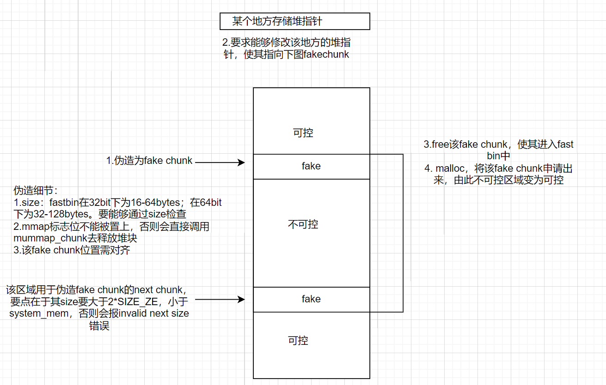

faster faster faster!
## fastbin double free
注意点：
1. fast bin对double free有检查，即检查fast bin指向的chunk与victim是否相同。所以不能连续两次释放同一个chunk。可以通过中间多free另一个chunk来绕过
2. fast bin会检查目标地址 + 8(即fake chunk的size位)是否符合fast bin大小
该漏洞可配合tcache stash机制绕过tcache double free针对key指针的检查
## house of spirit
漏洞成因：堆溢出写

利用效果：造成某特殊地址可任意写
虽然是fast bin attack，但该思路对libc 2.26以上版本的tcache仍然适用，甚至没有对next chunk size的检查
## Alloc to Stack
