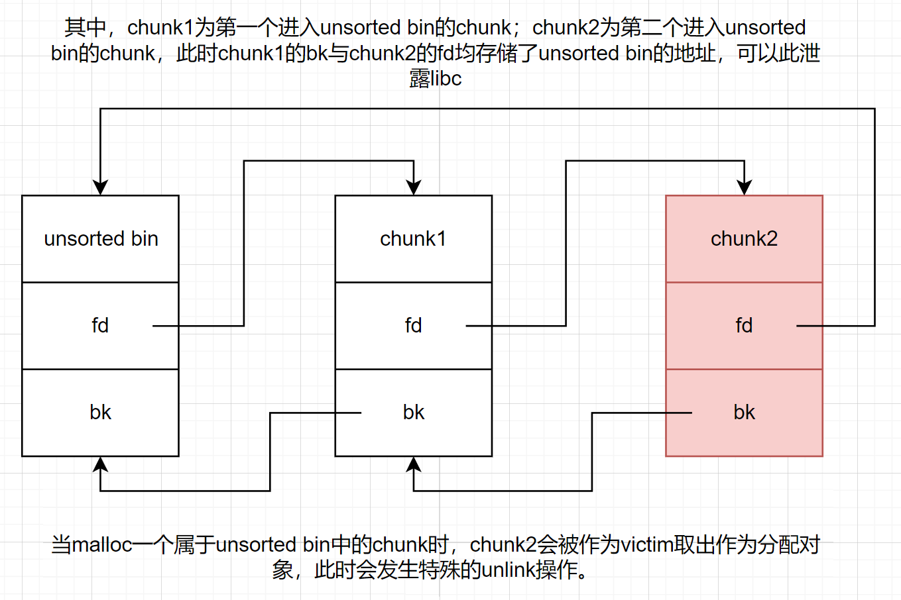
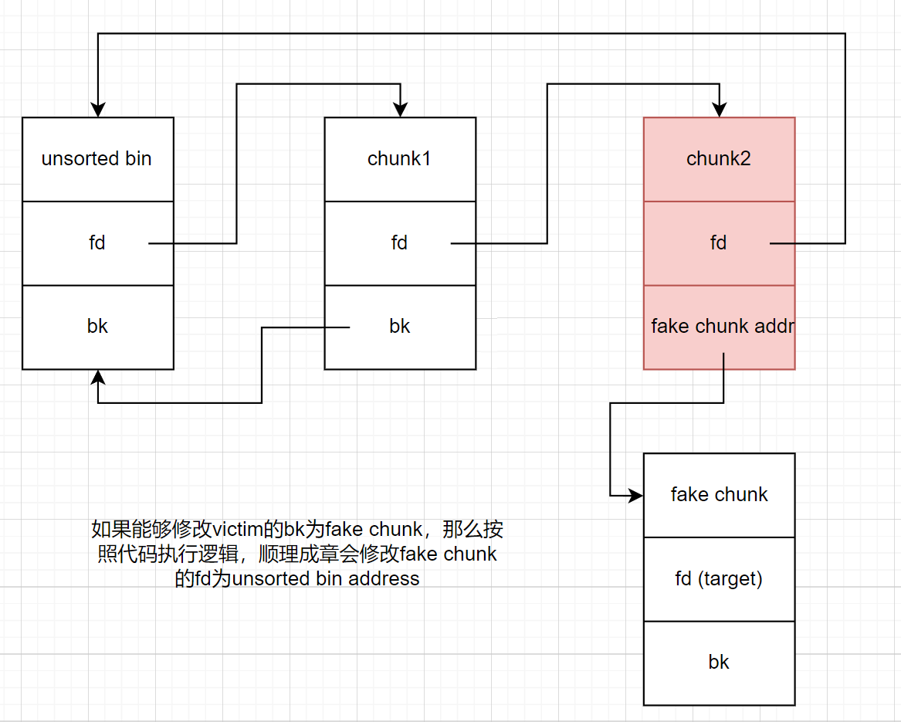

阵营：混沌中立

## unsorted bin leak
由于unsorted bin为双向循环链表，其中的chunk的fd与bk指针均可在一定条件下存储着main_arena+offset地址，通过该地址可以计算出libc基地址（问题就是如何在该chunk进入unsorted bin之后你依然能够输出其中内容，这交给UAF或其他攻击手法）

## unsorted bin attack
该攻击主要利用unsorted bin作为双向循环链表的特性，利用其unlink的过程

利用条件：可修改unsorted bin中的chunk的bk指针

利用效果：向目标地址写入一个极大值(该值实际上是main_arena的一个固定偏移)

正常情况下的unsorted bin:


当unlink时，会执行下面关键代码：
```c
          bck = victim -> bk
          unsorted_chunks (av)->bk = bck;
          bck->fd = unsorted_chunks (av);
```

尤其是最后一行`bck->fd = unsorted_chunks (av)`成为实施攻击的关键


## 高版本进行unsorted bin attack需要注意的事项
当高版本有tcache之后，特别是在tcache未满时，从unsorted bin中malloc到的堆块并不会直接返回，而是先放入tcache bin中，再从tcache bin中取chunk，此时该攻击方法会出现问题。

绕过：

