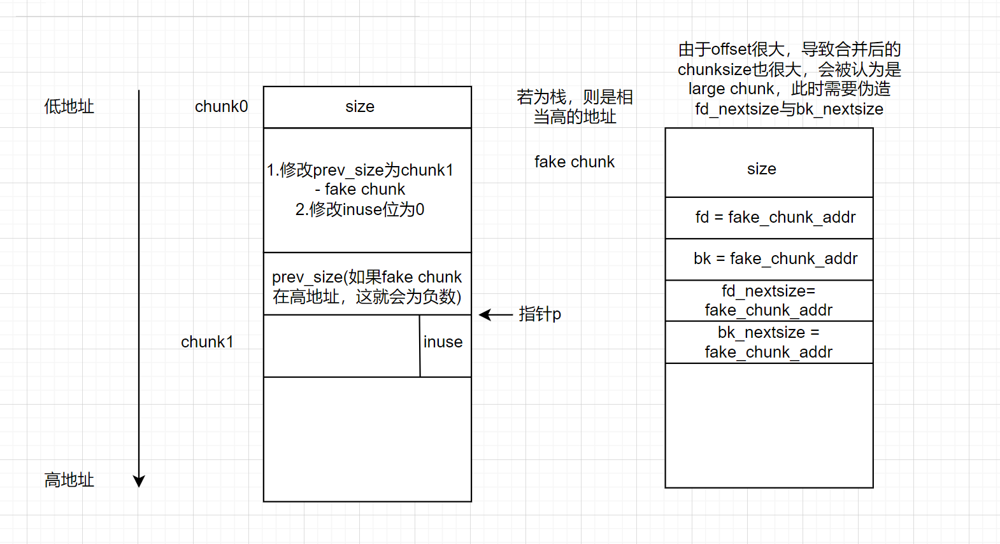
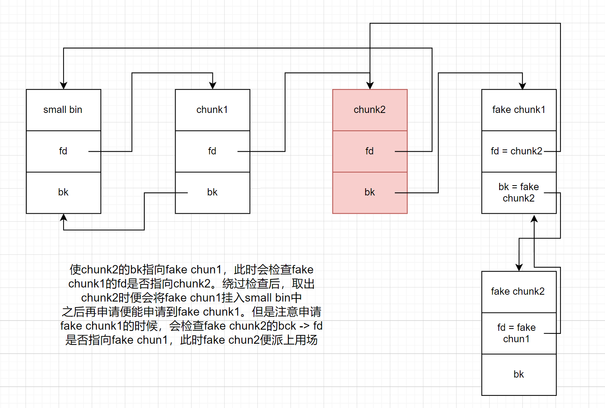

网安学妹会梦到土木学长吗？

只记录在其他部分未曾记录的house of 手法

## house of einherjar
非常类似于unsafe unlink，只是这次构造的fake chunk不在低地址chunk的user data内部，而是在任意位置（栈/bss等位置）

以及我们利用的点不在于unlink操作本身，我们要绕过unlink的保护机制；真正的利用点在于unlink之后的后向合并操作。

利用条件：offbynull/offbyone/堆溢出写; 泄露堆地址与目标地址(用于计算offset)

```c
   /* consolidate backward */
   if (!prev_inuse(p)) {
     prevsize = p->prev_size;
     size += prevsize;
     p = chunk_at_offset(p, -((long) prevsize));
     unlink(av, p, bck, fwd);
   }
```


我们需要绕过的unlink的check:
```c
// 由于 P 已经在双向链表中，所以有两个地方记录其大小，所以检查一下其大小是否一致(size检查)
if (__builtin_expect (chunksize(P) != prev_size (next_chunk(P)), 0)) \
malloc_printerr ("corrupted size vs. prev_size");


// 检查 fd 和 bk 指针(双向链表完整性检查)
if (__builtin_expect (FD->bk != P || BK->fd != P, 0)) \
malloc_printerr (check_action, "corrupted double-linked list", P, AV);
```
第二个检查我们轻易绕过，对于第一个检查(glibc 2.27加入)，我们需要设置fake chunk的size为fakesize，并且在fake chunk的距离fakesize的虚假nextchunk处的prev_size做相应设置。

绕过这些检查后并成功后向合并后，该chunk会被放入unsorted bin中，此时unsorted bin中只有一个chunk即fake chunk。将其申请出来即可完成利用

## house of force
如果当前所有空闲chunk都无法满足用户需求，glibc就会从top chunk中分割一块chunk出来分配给用户：
```c
// 获取当前的top chunk，并计算其对应的大小
victim = av->top;
size   = chunksize(victim);
// 如果在分割之后，其大小仍然满足 chunk 的最小大小，那么就可以直接进行分割。
if ((unsigned long) (size) >= (unsigned long) (nb + MINSIZE)) 
{
    remainder_size = size - nb;
    remainder      = chunk_at_offset(victim, nb);
    av->top        = remainder;
    set_head(victim, nb | PREV_INUSE |
            (av != &main_arena ? NON_MAIN_ARENA : 0));
    set_head(remainder, remainder_size | PREV_INUSE);

    check_malloced_chunk(av, victim, nb);
    void *p = chunk2mem(victim);
    alloc_perturb(p, bytes);
    return p;
}
```
如果用户能够修改top chunk的size为一个很大的值就可以随意绕过该验证，修改为-1从而整型溢出也是可以的

该方法 2.27即失效，后面需要学的时候再来看吧

## house of lore

我愿称之为small bin into stack

利用small bin的堆分配机制将堆分配到栈上或其他任意位置

需要泄露或已知目标地址、可以利用到small bin、可以修改到small bin中的chunk的bk指针、对目标地址可以伪造fake_chunk的fd指针

利用原理：
如果向small bin中申请chunk(0x20 - 0x410)

```c 
    /*
       If a small request, check regular bin.  Since these "smallbins"
       hold one size each, no searching within bins is necessary.
       (For a large request, we need to wait until unsorted chunks are
       processed to find best fit. But for small ones, fits are exact
       anyway, so we can check now, which is faster.)
     */

    if (in_smallbin_range(nb)) {
        // 获取 small bin 的索引
        idx = smallbin_index(nb);
        // 获取对应 small bin 中的 chunk 指针
        bin = bin_at(av, idx);
        // 先执行 victim = last(bin)，获取 small bin 的最后一个 chunk
        // 如果 victim = bin ，那说明该 bin 为空。
        // 如果不相等，那么会有两种情况
        if ((victim = last(bin)) != bin) {
            // 第一种情况，small bin 还没有初始化。
            if (victim == 0) /* initialization check */
                // 执行初始化，将 fast bins 中的 chunk 进行合并
                malloc_consolidate(av);
            // 第二种情况，small bin 中存在空闲的 chunk
            else {
                // 获取 small bin 中倒数第二个 chunk 。
                bck = victim->bk;
                // 检查 bck->fd 是不是 victim，防止伪造
                if (__glibc_unlikely(bck->fd != victim)) {
                    errstr = "malloc(): smallbin double linked list corrupted";
                    goto errout;
                }
                // 设置 victim 对应的 inuse 位
                set_inuse_bit_at_offset(victim, nb);
                // 修改 small bin 链表，将 small bin 的最后一个 chunk 取出来
                bin->bk = bck;
                bck->fd = bin;
                // 如果不是 main_arena，设置对应的标志
                if (av != &main_arena) set_non_main_arena(victim);
                // 细致的检查
                check_malloced_chunk(av, victim, nb);
                // 将申请到的 chunk 转化为对应的 mem 状态
                void *p = chunk2mem(victim);
                // 如果设置了 perturb_type , 则将获取到的chunk初始化为 perturb_type ^ 0xff
                alloc_perturb(p, bytes);
                return p;
            }
        }
    }
```
由于与unsorted bin同为双向链表，其出链的方式与unsorted bin如出一辙，因此两者都可以进行house of lore攻击



此处解释一下：之所以fake chunk1能挂入链中，关键在于small bin取chunk是从链尾取的，即`victim = last(bin)`，而last()即从`bin -> bk` 索引。在将chunk2从链中取出时，会将`bin -> bk = bck`，由此挂入链中

版本影响：
- glibc 2.23 - 2.25 均可以打
- glibc 2.26之后 要考虑tcache带来的影响
- glibc 2.31 失效

## house of orange

简而言之，就是当题目中没有提供free()的时候，我们能通过漏洞利用，获得一个在unsorted bin中的堆块。

虽然这个效果本身看起来很小，但配合其他攻击手法就能做很多事情

原理:

当top chunk无法满足我们的需求，原本的top chunk就会被丢进unsorted bin中作为一个free chunk

看起来简单，但实际上需要满足一些条件：
- sysmalloc有mmap与brk两种分配方式，我们需要让堆以brk的方式拓展，这样才能使chunk进入unsorted bin中。要符合该条件，malloc的尺寸不能大于mmp.mmap_threshold = 128k(否则会直接使用mmap)
- 其次要满足sysmalloc中对top size的合法性检查：size 要大于 MINSIZE(0x10)、size 要小于之后申请的 chunk size + MINSIZE(0x10)、size 的 prev inuse 位必须为 1

程序或许不会允许分配过大的内存，此时我们可以通过堆溢出写，将top chunk的size按照上述条件进行调整，然后再进行malloc

后续利用涉及IO，将在另一篇文章中详述

## house of rabbit


