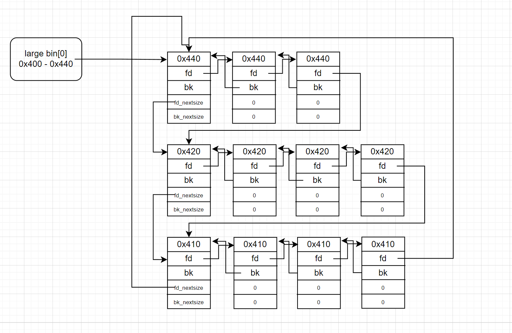

## large bin    

下图为0x400 - 0x440范围的large bin链表：

- 大小从大到小排序
- 若大小相同，按照释放时间排序
- 相同大小的堆块链中，只有头堆块的fd_nextsize与bk_nextsize有值，其余都为0

## large bin的插入操作

chunk会寻找与自己大小相同的chunk链并插入其中，如果没有则自成一派，成为头部

但注意：
- chunk会先与最小的chunk链size比较(即链表尾)，如果小于则直接放入尾部
- 第二步才从链表头开始遍历比较大小寻找位置插入其中

## large bin的取出操作

- 在对应大小的bin中通过bk_nextsize逆向遍历该链表，寻找大于等于malloc(size)的表
- 为减少操作，victim是对应表的第二个节点（能够减少堆fd_nextsize/bk_nextsize的操作）
- 调用unlink取victim
- 切割victim，判断remainder是否小于MIN_SIZE，如果小于则直接返回给user，否则进入unsorted bin

## 申请利用

修改bk_nextsize从而使得申请到错误的chunk，造成任意地址写

## 插入利用

